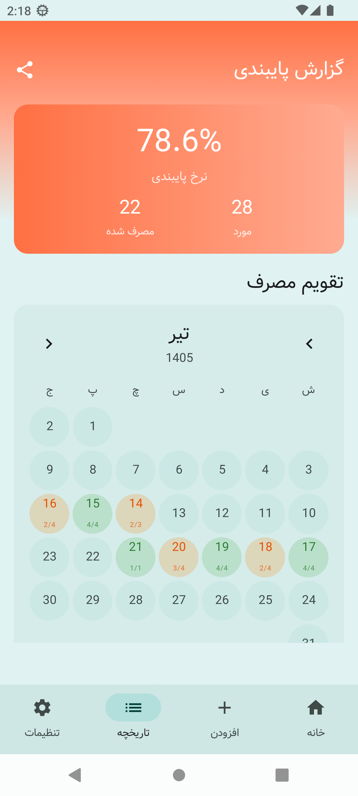

# MediMate - Advanced Medicine Reminder 💊⏰

An advanced, smart, and beautiful medication reminder app built with **Jetpack Compose** and **Clean Architecture**.

## Features

### Core
- **Advanced Scheduling:** Hourly, daily, weekly, even/odd days, and custom cycles (e.g., 2 weeks on, 1 week off)
- **Comprehensive Pill Profile:** Track medicine name, dosage, form (tablet, syrup, etc.), instructions, and reason
- **Pill Tracker (Inventory):** Manage stock with automatic decrement and low-stock notifications
- **Actionable Notifications:** Mark medicines as "Taken" or "Snooze" directly from the notification

### Drug Safety
- **Offline Drug-Drug Interaction Engine:** Pre-populated database with 85+ common drug interactions. Real-time warnings when adding medications that conflict with your current prescriptions

### Reliability
- **Ultra-Reliable Alarm Scheduler:** UTC-normalized timestamps, `SCHEDULE_EXACT_ALARM` permission handling, timezone change detection, and automatic alarm rescheduling on device reboot
- **Background Rescheduling:** WorkManager safety net ensures alarms are restored even if the OS kills them

### Data Management
- **CSV Export & Sharing:** Export medication history as CSV and share via Telegram, WhatsApp, Email, or any app using Android's native Share Sheet
- **Local Backup:** All data stays on-device with no external API dependencies

### Home Screen Widget
- **Jetpack Glance Widget:** View your next 3 scheduled medications directly on your home screen with a functional "Taken" button that updates the database without opening the app

### Reports
- **Adherence Reports:** Visual calendar and percentage-based health reports to track your progress

### Design
- **Material 3 UI:** Modern design with full Light/Dark mode support and Dynamic Color (Android 12+)
- **Polished UX:** Animated transitions, consistent spacing system, reusable component library, and edge-to-edge display

## Tech Stack

- **Jetpack Compose** - Modern reactive UI
- **Material 3** - Latest design standards with dynamic color
- **Room** - Local database with TypeConverters and migrations
- **Dagger Hilt** - Dependency injection
- **WorkManager & AlarmManager** - Background tasks and precise scheduling
- **Jetpack Glance** - Home screen widget
- **Coroutines & Flow** - Asynchronous programming
- **Gson** - JSON parsing for drug interaction data

## Architecture

```
app/src/main/java/ir/danialchoopan/medimate/
├── app/                    # Application class
├── data/
│   ├── local/              # Room database, DAOs, entities, TypeConverters
│   ├── repository/         # Repository implementations
│   └── workers/            # WorkManager workers
├── domain/
│   ├── model/              # Domain models
│   ├── repository/         # Repository interfaces
│   └── usecase/            # Business logic use cases
├── di/                     # Hilt dependency injection modules
├── presentation/
│   ├── components/         # Reusable UI components
│   ├── screens/            # Compose screens
│   ├── theme/              # Material 3 theme
│   └── viewmodel/          # ViewModels
├── util/                   # Utilities (scheduling, notifications, etc.)
└── widget/                 # Jetpack Glance widget
```

## Database

- **Version:** 3
- **Tables:** medicines, reminders, medication_logs, inventory, drug_interactions
- **Features:** Foreign keys with CASCADE delete, TypeConverters for enums

## Getting Started

### Installation
1. Clone the repository:
   ```bash
   git clone https://github.com/danialchoopan/daromate.git
   ```
2. Open the project in **Android Studio Ladybug** or newer.
3. Sync Gradle and run the app.

### Permissions
- `POST_NOTIFICATIONS` - Required for Android 13+ (requested at runtime)
- `SCHEDULE_EXACT_ALARM` - For precise medication reminders
- `WAKE_LOCK` - Ensures alarms fire in Doze mode

## Screenshots

| Dashboard | Add Medicine | History | Widget |
| :---: | :---: | :---: | :---: |
|  |  |  |  |

---

Built with ❤️ for health.
