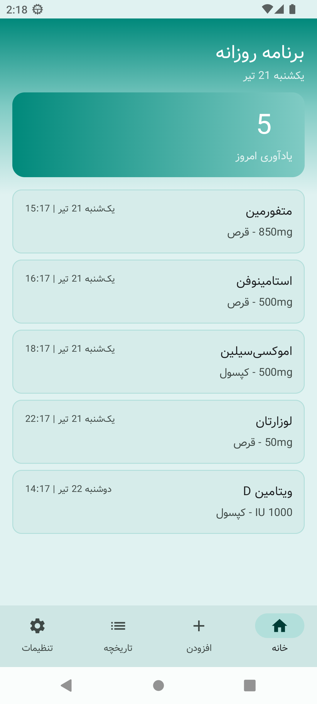
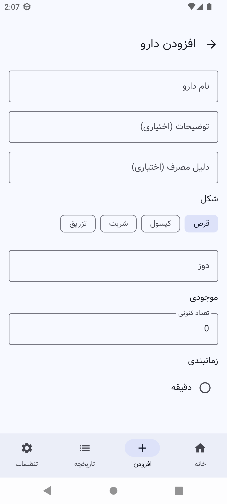
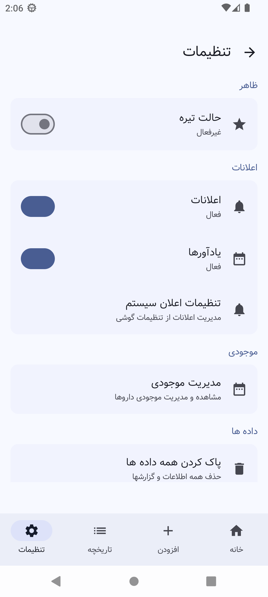

# دارویار - یادآور پیشرفته دارو 💊⏰

یک اپلیکیشن پیشرفته، هوشمند و زیبا برای یادآوری مصرف دارو که با **Jetpack Compose** و معماری **Clean Architecture** ساخته شده است.

## ویژگی‌ها

### اصلی
- **زمان‌بندی پیشرفته:** ساعتی، روزانه، هفتگی، روزهای زوج/فرد و دوره‌های سفارشی
- **پروفایل جامع دارو:** ثبت نام دارو، دوز مصرفی، شکل دارو، دستورالعمل مصرف و علت مصرف
- **مدیریت موجودی:** مدیریت موجودی داروها با هشدار کمبود
- **یادآوری‌های تعاملی:** تایید مصرف یا تاخیر مستقیماً از اعلان

### ایمنی دارویی
- **موتور بررسی تداخلات دارویی:** پایگاه داده ۸۵+ تداخل رایج دارویی به صورت آفلاین

### قابلیت اطمینان
- **زمان‌بندی قابل اتکا:** زمان‌بندی UTC، تشخیص تغییرات منطقه زمانی، بازیابی خودکار یادآوری‌ها

### مدیریت داده
- **خروجی CSV:** گزارش تاریخچه مصرف دارویی با اشتراک‌گذاری
- **تقویم جلالی:** نمایش تقویم ایرانی با وضعیت مصرف هر روز

### اعلان‌ها
- **اعلان‌های هوشمند:** کار با تمام نسخه‌های اندروید (۵ تا ۱۴+)
- **صدای زنگ دارو:** با لرزش و نمایش روی صفحه قفل

### رابط کاربری
- **Material 3 با رنگ‌های زنده:** تم سبز فیروزه‌ای با گرادیانت
- **فونت وزیر:** فونت فارسی حرفه‌ای
- **پشتیبانی RTL:** راست به چپ کامل
- **تاریک/روشن:** حالت تیره با ذخیره تنظیمات
- **ویجت خانگی:** نمایش ۳ یادآوری بعدی با دکمه مصرف

## تکنولوژی‌های مورد استفاده

- **Jetpack Compose** - رابط کاربری مدرن واکنشی
- **Material 3** - طراحی مدرن با رنگ‌های پویا
- **Room** - پایگاه داده محلی با TypeConverter و مایگریشن
- **Dagger Hilt** - تزریق وابستگی
- **WorkManager & AlarmManager** - وظایف پس‌زمینه و زمان‌بندی دقیق
- **Jetpack Glance** - ویجت صفحه خانگی
- **Coroutines & Flow** - برنامه‌نویسی ناهمگام
- **Gson** - پارس JSON برای تداخلات دارویی
- **DataStore** - ذخیره تنظیمات کاربر

## معماری

```
app/src/main/java/ir/danialchoopan/medimate/
├── app/                    # کلاس Application
├── data/
│   ├── local/              # Room DB، DAO، Entity، TypeConverter
│   ├── repository/         # پیاده‌سازی Repository
│   └── workers/            # WorkManager Worker
├── domain/
│   ├── model/              # مدل‌های دامنه
│   ├── repository/         # رابط‌های Repository
│   └── usecase/            # منطق کسب‌وکار
├── di/                     # ماژول‌های Hilt DI
├── presentation/
│   ├── components/         # کامپوننت‌های قابل استفاده مجدد
│   ├── screens/            # صفحات Compose
│   ├── theme/              # تم Material 3
│   └── viewmodel/          # ViewModel
├── util/                   # ابزارها (زمان‌بندی، اعلان و...)
└── widget/                 # ویجت Jetpack Glance
```

## پایگاه داده

- **نسخه:** 3
- **جداول:** medicines, reminders, medication_logs, inventory, drug_interactions
- **ویژگی‌ها:** کلیدهای خارجی با CASCADE، TypeConverter برای enum

## شروع کار

### نصب
1. پروژه را کلون کنید:
   ```bash
   git clone https://github.com/danialchoopan/daromate.git
   ```
2. پروژه را در **Android Studio Ladybug** یا نسخه‌های جدیدتر باز کنید.
3. گریدل را سینک کرده و اپلیکیشن را اجرا کنید.

### دسترسی‌ها
- `POST_NOTIFICATIONS` - برای اندروید ۱۳ به بالا (درخواست در زمان اجرا)
- `SCHEDULE_EXACT_ALARM` - برای یادآوری‌های دقیق
- `WAKE_LOCK` - برای نمایش اعلان روی صفحه قفل

## اسکرین‌شات‌ها

| یادآوری | افزودن دارو | تاریخچه | تنظیمات |
| :---: | :---: | :---: | :---: |
|  |  |  |  |

---

ساخته شده با ❤️ توسط دنیال چوپان برای سلامتی.
